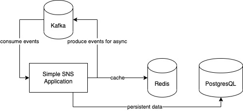

# SNS

## Application Architecture


## Flow Chart

1. 회원가입

```
    client ->> server: 회원가입 요청
    
    성공한 경우
    server -->> client: 성공 반환
    
    아이디가 중복된 경우 
    server -->> client: reason code와 함께 실패 반환
```

2. 로그인

```
    client ->> server: 로그인
    
    성공한 경우 
    server ->> client: 성공 반환
    
    아이디가 존재하지 않는 경우 
    server -->> client: reason code와 함께 실패 반환
    
    패스워드가 틀린 경우
    server -->> client: reason code와 함께 실패 반환
```

3. 포스트 작성

```
    client ->> server: 포스트 작성 요청
    
    성공한 경우 
    server ->> db : 포스트 저장 요청
    db -->> server : 저장 성공 반환
    server -->> client: 성공 반환
    
    로그인하지 않은 경우
    server -->> client: reason code와 함께 실패 반환
    db 에러
    server ->> db : 포스트 저장 요청
    db -->> server : 에러 반환
    server -->> client: reason code와 함께 실패 반환
    
    내부 에러
    server -->> client: reason code와 함께 실패 반환
```

4. 포스트 삭제

```
    client ->> server: 포스트 삭제 요청
    
    성공한 경우 
    server ->> db : 포스트 삭제 요청
    db -->> server : 삭제 성공 반환
    server -->> client: 성공 반환
    
    로그인하지 않은 경우
    server -->> client: reason code와 함께 실패 반환
    
    db 에러
    server ->> db : 포스트 삭제 요청
    db -->> server : 에러 반환
    server -->> client: reason code와 함께 실패 반환
    
    내부 에러
    server -->> client: reason code와 함께 실패 반환
```

5. 포스트 수정

```
    client ->> server: 포스트 수정 요청
    
    성공한 경우 
    server ->> db : 포스트 수정 요청
    db -->> server : 수 성공 반환
    server -->> client: 성공 반환
    로그인하지 않은 경우
    
    server -->> client: reason code와 함께 실패 반환
    
    db 에러
    server ->> db : 포스트 수정 요청
    db -->> server : 에러 반환
    server -->> client: reason code와 함께 실패 반환
    
    내부 에러
    server -->> client: reason code와 함께 실패 반환
```

6. 피드 목록

```
    client ->> server: 피드 목록 요청
    
    성공한 경우 
    server ->> db : 포스트 목록 요청
    db -->> server : 목록 쿼리 성공 반환
    server -->> client: 목록 반환
    
    로그인하지 않은 경우
    server -->> client: reason code와 함께 실패 반환
    
    db 에러
    server ->> db : 포스트 목록 요청
    db -->> server : 에러 반환
    server -->> client: reason code와 함께 실패 반환
    
    내부 에러
    server -->> client: reason code와 함께 실패 반환
```

7. 좋아요 기능 : User A가 B 게시물에 좋아요를 누른 상황

```
    client ->> server: 좋아요 요청 
    
    성공한 경우 
    server ->> db : db update 요청
    db -->> server : 성공 반환
    server -->> client: 성공 반환
    
    로그인하지 않은 경우
    server -->> client: reason code와 함께 실패 반환
    
    db 에러
    server ->> db : db update 요청
    db -->> server : 에러 반환
    server -->> client: reason code와 함께 실패 반환
    
    B 게시물이 존재하지 않는 경우 
    server ->> db : db update 요청
    db -->> server : 에러 반환
    server -->> client: reason code와 함께 실패 반환
    
    내부 에러
    server -->> client: reason code와 함께 실패 반환
```

```
    client ->> server: 좋아요 요청 
    
    성공한 경우 
    server ->> db : 좋아요 누를 수 있는 조건 체크 
    db -->> server : 응답 
    server --) kafka : event produce request
    server->>client: 성공 반환
    kafka --) server : event consume 
    server ->> db : db update 요청
    db -->> server : 성공 반환 
    
    로그인하지 않은 경우
    server->>client: reason code와 함께 실패 반환
    
    db 에러
    server ->> db : 좋아요 누를 수 있는 조건 체크 
    db -->> server : 응답 
    server --) kafka : event produce request
    server->>client: 성공 반환
    kafka --) server : event consume 
    loop db update 실패시 최대 3회 재시도 한다
        server ->> db : db update 요청
    
    db -->> server : 실패 반환 
    
    B 게시물이 존재하지 않는 경우 
    server ->> db : 좋아요 누를 수 있는 조건 체크 
    db ->> server : 에러 반환
    server->>client: reason code와 함께 실패 반환
    
    내부 에러
    server->>client: reason code와 함께 실패 반환
```

8. 댓글 기능 : User A가 B 게시물에 댓글을 남긴 상황

```
    client ->> server: 댓글 작성
    
    성공한 경우
    server ->> db : db update 요청
    db ->> server : 성공 반환
    server->>client: 성공 반환

    로그인하지 않은 경우
    server->>client: reason code와 함께 실패 반환
    
    db 에러
    server ->> db : db update 요청
    db ->> server : 에러 반환
    server->>client: reason code와 함께 실패 반환
    
    B 게시물이 존재하지 않는 경우 
    server ->> db : db update 요청
    db ->> server : 에러 반환
    server->>client: reason code와 함께 실패 반환
    
    내부 에러
    server->>client: reason code와 함께 실패 반환
```

```
    client ->> server: 댓글 작성
    
    성공한 경우 
    server ->> db : 좋아요 누를 수 있는 조건 체크 
    db -->> server : 응답 
    server --) kafka : event produce request
    server->>client: 성공 반환
    kafka --) server : event consume 
    server ->> db : db update 요청
    db -->> server : 성공 반환 
    
    로그인하지 않은 경우
    server->>client: reason code와 함께 실패 반환
    
    db 에러
    server ->> db : 댓글 작성 조건 체크 
    db -->> server : 응답 
    server --) kafka : event produce request
    server->>client: 성공 반환
    kafka --) server : event consume 
    loop db update 실패시 최대 3회 재시도 한다
        server ->> db : db update 요청
    
    db -->> server : 실패 반환 
    
    B 게시물이 존재하지 않는 경우 
    server ->> db : 댓글 작성 조건 체크 
    db ->> server : 에러 반환
    server->>client: reason code와 함께 실패 반환
    
    내부 에러
    server->>client: reason code와 함께 실패 반환
```

9. 알람 기능 : User A의 알람 목록에 대한 요청을 한 상황

```
    client ->> server: 알람 목록 요청 
    
    성공한 경우
    server ->> db : db query 요청
    db ->> server : 성공 반환
    server->>client: 성공 반환

    로그인하지 않은 경우
    server->>client: reason code와 함께 실패 반환
    
    db 에러
    server ->> db : db query 요청
    db ->> server : 에러 반환
    server->>client: reason code와 함께 실패 반환

    내부 에러
    server->>client: reason code와 함께 실패 반환
```